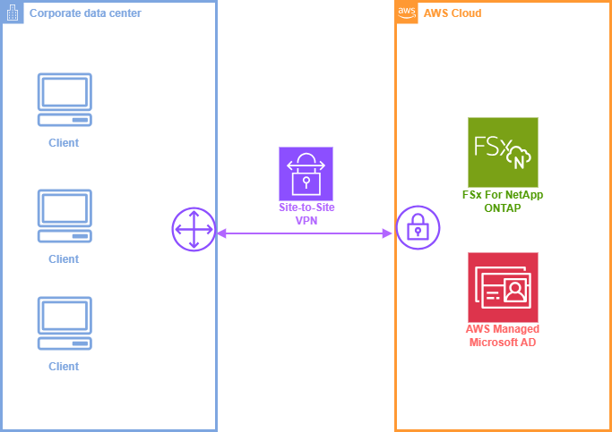
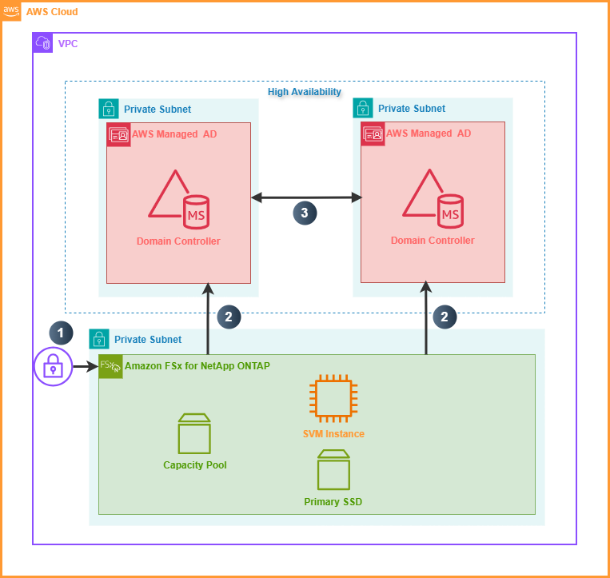

# NAS 서비스 아키텍처 명세서 초안

## 1. 문서 목적

본 문서는 NAS 서비스의 상위 서비스 아키텍처와 네트워크 흐름을 정의하기 위한 초안이다.  
현재 구성은 AWS Cloud 상의 `Amazon FSx for NetApp ONTAP`를 스토리지 계층으로 사용하고, 인증 및 디렉터리 서비스는 `AWS Managed Microsoft AD`를 통해 제공하는 구조를 기준으로 정리하였다.

## 2. 아키텍처 개요

본 아키텍처는 사내 물리 환경 또는 외부 연계 구간과 AWS Cloud 간의 보안 연결을 기반으로 동작한다.  
스토리지 서비스는 AWS 내부의 프라이빗 서브넷에 배치되며, 사용자 인증과 파일 서비스 권한 관리는 AWS Managed Microsoft AD와 연동하여 처리한다.

핵심 설계 방향은 다음과 같다.

- 스토리지와 인증 시스템을 모두 프라이빗 네트워크 내에 배치한다.
- 디렉터리 서비스는 다중 서브넷에 이중화하여 고가용성을 확보한다.
- 파일 서비스 접근은 인증 체계와 분리하지 않고 AD 기반으로 일관되게 통제한다.
- 외부 구간과 AWS 구간 사이에는 암호화된 보안 연결을 적용한다.

## 3. 서비스 아키텍처

### 3.1 구성 설명

서비스 아키텍처는 다음의 계층으로 구성된다.

| 구분 | 구성 요소 | 설명 |
|---|---|---|
| 외부/물리 구간 | 사내 물리 환경 또는 연계 네트워크 | NAS를 사용하는 사용자, 시스템, 업무 서버가 위치하는 영역 |
| 연결 구간 | 보안 네트워크 연결 | 온프레미스와 AWS 간의 암호화된 연결 경로 |
| 클라우드 스토리지 | Amazon FSx for NetApp ONTAP | NAS 볼륨, SVM, 저장 용량을 제공하는 핵심 스토리지 서비스 |
| 인증/권한 | AWS Managed Microsoft AD | 사용자 인증, 도메인 조인, 파일 권한 제어를 담당하는 디렉터리 서비스 |

### 3.2 동작 개념

1. 사용자는 물리 환경 또는 내부 업무 시스템에서 NAS 서비스에 접근한다.
2. 접근 요청은 보안 연결 구간을 통해 AWS Cloud로 전달된다.
3. 파일 저장 및 공유는 Amazon FSx for NetApp ONTAP에서 처리한다.
4. 인증 및 접근 권한 검증은 AWS Managed Microsoft AD를 통해 수행한다.

## 4. 네트워크 흐름도

### 4.1 네트워크 구성

네트워크 흐름도 기준의 주요 구성은 다음과 같다.

| 영역 | 구성 요소 | 설명 |
|---|---|---|
| VPC | AWS 전용 네트워크 영역 | NAS 서비스 전체가 배치되는 논리적 네트워크 |
| Private Subnet | FSx for ONTAP 배치 구간 | 스토리지 리소스를 외부에 직접 노출하지 않는 서브넷 |
| Private Subnet x 2 | AWS Managed AD 배치 구간 | 서로 다른 서브넷에 도메인 컨트롤러를 분산 배치 |
| FSx ONTAP 내부 리소스 | SVM Instance, Capacity Pool, Primary SSD | 파일 서비스, 저장 용량, 성능 계층을 담당 |
| Managed AD | Domain Controller x 2 | 인증, 디렉터리 조회, 정책 적용, 복제를 수행 |

### 4.2 흐름 설명

다이어그램의 번호 기준 흐름은 다음과 같다.

1. 클라이언트 또는 연계 시스템은 보안 통제된 경로를 통해 `Amazon FSx for NetApp ONTAP`에 접근한다.
2. FSx ONTAP는 파일 서비스 인증 및 권한 처리를 위해 각 프라이빗 서브넷에 배치된 `AWS Managed Microsoft AD Domain Controller`와 통신한다.
3. 두 Domain Controller는 상호 복제를 통해 디렉터리 정보와 인증 상태를 동기화하며, 가용성과 장애 대응성을 확보한다.

## 5. 상세 설계 원칙

### 5.1 보안

- 모든 핵심 리소스는 프라이빗 서브넷에 배치한다.
- 인증 계층은 AD 기반으로 통합하여 사용자 및 그룹 권한을 일관되게 관리한다.
- 외부 연계 구간은 암호화된 연결을 전제로 구성한다.
- 스토리지 직접 노출을 최소화하고 접근 제어는 네트워크와 인증 체계 양쪽에서 수행한다.

### 5.2 가용성

- AWS Managed Microsoft AD는 서로 다른 서브넷에 이중화 배치한다.
- 인증 서비스 장애가 단일 지점 장애로 이어지지 않도록 복제 구조를 유지한다.
- 스토리지 서비스는 AWS 관리형 서비스 기반으로 운영 복잡도를 낮춘다.

### 5.3 운영

- 파일 서비스 계층은 FSx for ONTAP에서 담당한다.
- 사용자 및 권한 정책은 AD 중심으로 관리한다.
- 네트워크, 인증, 스토리지 책임 구간을 분리해 장애 분석과 운영 절차를 단순화한다.

## 6. 구성 요소별 역할

| 구성 요소 | 역할 |
|---|---|
| Amazon FSx for NetApp ONTAP | NAS 스토리지 제공, 파일 시스템 및 볼륨 운영 |
| SVM Instance | 파일 서비스 엔드포인트 및 스토리지 가상화 계층 |
| Primary SSD | 주 저장 성능 계층 |
| Capacity Pool | 확장 저장 용량 계층 |
| AWS Managed Microsoft AD | 사용자 인증, 도메인 서비스, 정책 및 권한 관리 |
| Domain Controller | 인증 처리, 디렉터리 조회, 복제 수행 |

## 7. 예상 접근 시나리오

1. 사용자가 NAS 공유 경로 또는 애플리케이션을 통해 스토리지 접근을 요청한다.
2. 요청은 AWS 내 FSx for ONTAP 서비스로 전달된다.
3. FSx for ONTAP는 AD에 사용자 인증 및 권한 확인을 요청한다.
4. AD 검증이 완료되면 사용자는 허용된 파일 또는 디렉터리에 접근한다.
5. 데이터는 FSx ONTAP 저장 계층에 기록되며 운영 정책에 따라 관리된다.
